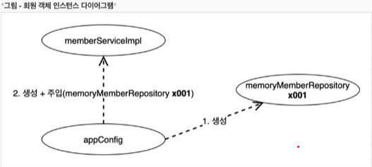

# 객체 지향 원리 적용
- 참고 : [애자일 소프트웨어 개발 선언](https://agilemanifesto.org/iso/ko/manifesto.html)


## 새로운 할인 정책 적용과 문제점

- 정액 할인 정책에서 정률 할인 정책으로 변경
- OCP, DIP를 모두 위반하는 상태
- 주문이 할인의 역할 뿐만 아니라 누구를 선택할지 책임도 지게 된다. -> 다양한 책임을 가짐

```java
public class OrderServiceImpl implements OrderService {
    
    //private final DiscountPolicy discountPolicy = new FixDiscountPolicy();
    private final DiscountPolicy discountPolicy = new RateDiscountPolicy();
}
```
> **DIP 위반**
 - 주문서비스 클라이언트(OrderServiceImpl)는 DiscountPolicy 인터페이스에 의존하면서 DIP를 지켰다?
   - 클래스 의존관계를 분석해보자. **추상(인터페이스)뿐만 아니라, 구체(구현)클래스에도 모두 의존**하는 상황
     - 추상(인터페이스)의존 : DiscountPolicy
     - 구체(구현)클래스 : FixDiscountPolicy, RateDiscountPolicy
     - 단순히 DiscountPolicy 인터페이스만 의존한다고 생각했지만, OrderServiceImpl이 DiscountPolicy 인터페이스 뿐만 아니라 구체 클래스도 함께 의존하고 있다.

> **OCP 위반**
- **지금 코드는 기능을 확장해서 변경하면, 클라이언트 코드에 영향을 준다!**

---


### DIP에 위반하지 않도록 구체클래스를 지워버린다.
```java
public class OrderServiceImpl implements OrderService {
    
    //private final DiscountPolicy discountPolicy = new FixDiscountPolicy();
    private DiscountPolicy discountPolicy;
}
```
- 그러나 구현체가 없는데 어떻게 코드를 실행할 수 있을까?
- 대입된 것이 없으므로 NPE(Null pointer Exception) 발생 -> DIP를 지키려면 OrderServiceImpl에 DiscountPolicy 의 구현 객체를 누군가가 대신 주입 해주어야 한다.

---


## 관심사의 분리

- 애플리케이션을 하나의 공연이라고 생각해보자. 실제 배역에 맞는 배우를 선택하는 것은 누가하는가?
- 로미오와 줄리엣 공연을 하는 상황, 이전 코드에서는 마치 로미오 역할(인터페이스)을 하는 레오나르도 디카프리오(구현체, 배우)가 줄리엣 역할(인터페이스)을 하는 여자 주인공(구현체, 배우)를 선택하는 것과 같다.
- 디카프리오는 공연도 해야하고 동시에 여자 주인공도 공연에 직접 초빙해야하는 **다양한 책임**을 갖고 있다
  - OrderServiceImpl(레오나르도 디카프리오) , DiscountPolicy(줄리엣 역할) , FixDiscountPolicy(케이트 윈슬렛)
- 배우는 본인의 역할인 배역을 수행하는 것에만 집중해야 한다. ( 주문은 주문만 집중 )
- 디카프리오는 어떤 여자 주인공이 선택되더라도 똑같이 공연을 할 수 있어야 한다.
- 공연을 구성하고, 담당 배우를 섭외하고, 역할에 맞는 배우를 지정하는 책임을 담당하는 별도의 **공연 기획자**가 필요
- 남자배우는 어떤 여자배우가 캐스팅될지 전혀 몰라야 한다!!

## AppConfig의 등장
- 애플리케이션의 전체 동작 방식을 구성(config)하기 위해, **구현 객체를 생성**하고 **연결**하는 책임을 가지는 별동의 설정 클래스를 만든다


- AppConfig를 이용해서 구현체를 선택한다.
- 객체의 생성과 연결은 AppConfig가 담당
- DIP: MemberServiceImpl 은 MemberRepository 추상에만 의존한다. 더이상 구체 클래스를 몰라도된다. 
- 관심사 분리: 객체를 생성하고 연결하는 역할과 실행하는 역할이 명확히 분리되었다.
- 할인정책을 변경할려면 아래 부분만 변경하면됨. DIP, OCP 만족

```java
public class AppConfig {

    // 생성자 주입 : 생성자를 통해 객체가 들어간다.
    public MemberService memberService() {
        return new MemberServiceImpl(new MemoryMemberRepository());
    }

    public OrderService orderService() {
        return new OrderServiceImpl(new MemoryMemberRepository(), new FixDisocuntPolicy());
    }
}
```
- AppConfig 는 생성한 객체 인스턴스의 참조(레퍼런스)를 **생성자를 통해서 주입(연결)** 해준다.
  - MemberServiceImpl -> MemoryMemberRepository
  - OrderServiceImpl -> MemoryMemberRepository, FixDiscountPolicy
```java
public class MemberServiceImpl implements MemberService{

    private final MemberRepository memberRepository;

    public MemberServiceImpl(MemberRepository memberRepository) {
        this.memberRepository = memberRepository;
    }

    @Override
    public void join(Member member) {
        memberRepository.save(member);
    }

    @Override
    public Member findMember(Long memberId) {
        return memberRepository.findById(memberId);
    }
}
```

- 설계 변경으로 MemberServiceImpl 은 MemoryMemberRepository 를 의존하지 않는다! - DIP 를 지킴
- 단지 MemberRepository 인터페이스만 의존한다!
- MemberServiceImpl 입장에서 생성자를 통해 어떤 구현 객체가 들어올지(주입될지)는 알 수 없다.
- MemberServiceImpl 의 생성자를 통해서 어떤 구현 객체를 주입할지는 오직 외부(AppConfig)에서 결졍된다
- MemberServiceImpl 은 이제부터 **의존관계에 대한 고민은 외부**에 맡기도 **실행에만 집중** 하면 된다.
  - Memory에서 가져오든, DB에서 가져오든 나의 관심사가 아니다. 나는 그냥 이제 인터페이스에 맞춰서 기능만 호출할 거야.



- appConfig 객체는 MemoryMemberRepository 객체를 생성하고, 그 참조값을 MemberServiceImpl을 생성하면서 생성자로 전달한다.
- 클라이언트인 MemberServiceImpl의 입장에서 보면 의존관계를 마치 외부에서 주입해주는 것과 같다고해서 **DI(Dependency Injection) 의존성 주입**이라 한다.

```java
public class OrderServiceImpl implements OrderService {
    
    private final MemberRepository memberRepository;
    private final DiscountPolicy discountPolicy;

    public OrderServiceImpl(MemberRepository memberRepository, DiscountPolicy discountPolicy) {
        this.memberRepository = memberRepository;
        this.discountPolicy = discountPolicy;
    }


    @Override
    public Order createOrder(Long memberId, String itemName, int itemPrice) {
        Member member = memberRepository.findById(memberId);
        int discountPrice = discountPolicy.discount(member, itemPrice);

        return new Order(memberId, itemName, itemPrice, discountPrice);
    }
}
```