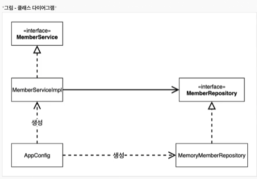
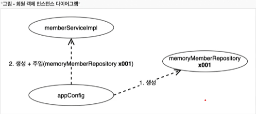
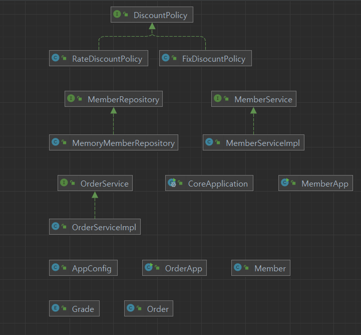
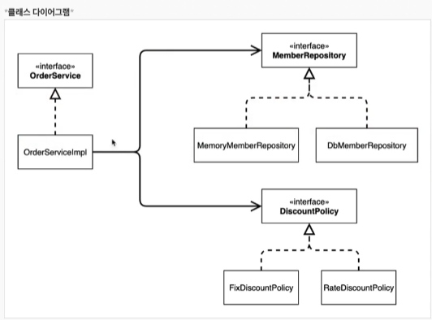
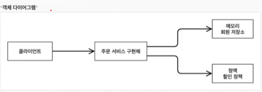

# 객체 지향 원리 적용

- 참고 : [애자일 소프트웨어 개발 선언](https://agilemanifesto.org/iso/ko/manifesto.html)

## 새로운 할인 정책 적용과 문제점

- 정액 할인 정책에서 정률 할인 정책으로 변경
- OCP, DIP를 모두 위반하는 상태
- 주문이 할인의 역할 뿐만 아니라 누구를 선택할지 책임도 지게 된다. -> 다양한 책임을 가짐

```java
public class OrderServiceImpl implements OrderService {

    //private final DiscountPolicy discountPolicy = new FixDiscountPolicy();
    private final DiscountPolicy discountPolicy = new RateDiscountPolicy();
}
```

> **DIP 위반**

- 주문서비스 클라이언트(OrderServiceImpl)는 DiscountPolicy 인터페이스에 의존하면서 DIP를 지켰다?
    - 클래스 의존관계를 분석해보자. **추상(인터페이스)뿐만 아니라, 구체(구현)클래스에도 모두 의존**하는 상황
        - 추상(인터페이스)의존 : DiscountPolicy
        - 구체(구현)클래스 : FixDiscountPolicy, RateDiscountPolicy
        - 단순히 DiscountPolicy 인터페이스만 의존한다고 생각했지만, OrderServiceImpl이 DiscountPolicy 인터페이스 뿐만 아니라 구체 클래스도 함께 의존하고 있다.

> **OCP 위반**

- **지금 코드는 기능을 확장해서 변경하면, 클라이언트 코드에 영향을 준다!**

---

### DIP에 위반하지 않도록 구체클래스를 지워버린다.

```java
public class OrderServiceImpl implements OrderService {

    //private final DiscountPolicy discountPolicy = new FixDiscountPolicy();
    private DiscountPolicy discountPolicy;
}
```

- 그러나 구현체가 없는데 어떻게 코드를 실행할 수 있을까?
- 대입된 것이 없으므로 NPE(Null pointer Exception) 발생 -> DIP를 지키려면 OrderServiceImpl에 DiscountPolicy 의 구현 객체를 누군가가 대신 주입 해주어야 한다.

---

## 관심사의 분리

- 애플리케이션을 하나의 공연이라고 생각해보자. 실제 배역에 맞는 배우를 선택하는 것은 누가하는가?
- 로미오와 줄리엣 공연을 하는 상황, 이전 코드에서는 마치 로미오 역할(인터페이스)을 하는 레오나르도 디카프리오(구현체, 배우)가 줄리엣 역할(인터페이스)을 하는 여자 주인공(구현체, 배우)를 선택하는 것과 같다.
- 디카프리오는 공연도 해야하고 동시에 여자 주인공도 공연에 직접 초빙해야하는 **다양한 책임**을 갖고 있다
    - OrderServiceImpl(레오나르도 디카프리오) , DiscountPolicy(줄리엣 역할) , FixDiscountPolicy(케이트 윈슬렛)
- 배우는 본인의 역할인 배역을 수행하는 것에만 집중해야 한다. ( 주문은 주문만 집중 )
- 디카프리오는 어떤 여자 주인공이 선택되더라도 똑같이 공연을 할 수 있어야 한다.
- 공연을 구성하고, 담당 배우를 섭외하고, 역할에 맞는 배우를 지정하는 책임을 담당하는 별도의 **공연 기획자**가 필요
- 남자배우는 어떤 여자배우가 캐스팅될지 전혀 몰라야 한다!!

## AppConfig의 등장

- 애플리케이션의 전체 동작 방식을 구성(config)하기 위해, **구현 객체를 생성**하고 **연결**하는 책임을 가지는 별동의 설정 클래스를 만든다



- AppConfig를 이용해서 구현체를 선택한다.
- 객체의 생성과 연결은 AppConfig가 담당
- DIP: MemberServiceImpl 은 MemberRepository 추상에만 의존한다. 더이상 구체 클래스를 몰라도된다.
- 관심사 분리: 객체를 생성하고 연결하는 역할과 실행하는 역할이 명확히 분리되었다.

```java
public class AppConfig {

    // 생성자 주입 : 생성자를 통해 객체가 들어간다.
    public MemberService memberService() {
        return new MemberServiceImpl(new MemoryMemberRepository());
    }

    public OrderService orderService() {
        return new OrderServiceImpl(new MemoryMemberRepository(), new FixDisocuntPolicy());
    }
}
```

- AppConfig 는 생성한 객체 인스턴스의 참조(레퍼런스)를 **생성자를 통해서 주입(연결)** 해준다.
    - MemberServiceImpl -> MemoryMemberRepository
    - OrderServiceImpl -> MemoryMemberRepository, FixDiscountPolicy

```java
public class MemberServiceImpl implements MemberService {

    private final MemberRepository memberRepository;

    public MemberServiceImpl(MemberRepository memberRepository) {
        this.memberRepository = memberRepository;
    }

    @Override
    public void join(Member member) {
        memberRepository.save(member);
    }

    @Override
    public Member findMember(Long memberId) {
        return memberRepository.findById(memberId);
    }
}
```

- 설계 변경으로 MemberServiceImpl 은 MemoryMemberRepository 를 의존하지 않는다! - DIP 를 지킴
- 단지 MemberRepository 인터페이스만 의존한다!
- MemberServiceImpl 입장에서 생성자를 통해 어떤 구현 객체가 들어올지(주입될지)는 알 수 없다.
- MemberServiceImpl 의 생성자를 통해서 어떤 구현 객체를 주입할지는 오직 외부(AppConfig)에서 결졍된다
- MemberServiceImpl 은 이제부터 **의존관계에 대한 고민은 외부**에 맡기도 **실행에만 집중** 하면 된다.
    - Memory에서 가져오든, DB에서 가져오든 나의 관심사가 아니다. 나는 그냥 이제 인터페이스에 맞춰서 기능만 호출할 거야.



- appConfig 객체는 MemoryMemberRepository 객체를 생성하고, 그 참조값을 MemberServiceImpl을 생성하면서 생성자로 전달한다.
- 클라이언트인 MemberServiceImpl의 입장에서 보면 의존관계를 마치 외부에서 주입해주는 것과 같다고해서 **DI(Dependency Injection) 의존성 주입**이라 한다.

```java
public class OrderServiceImpl implements OrderService {

    private final MemberRepository memberRepository;
    private final DiscountPolicy discountPolicy;

    public OrderServiceImpl(MemberRepository memberRepository, DiscountPolicy discountPolicy) {
        this.memberRepository = memberRepository;
        this.discountPolicy = discountPolicy;
    }


    @Override
    public Order createOrder(Long memberId, String itemName, int itemPrice) {
        Member member = memberRepository.findById(memberId);
        int discountPrice = discountPolicy.discount(member, itemPrice);

        return new Order(memberId, itemName, itemPrice, discountPrice);
    }
}
```
----

## 새로운 구조와 할인 정책 적용

```java
public class AppConfig {

    public MemberService memberService() {
        return new MemberServiceImpl(memberRepository());
    }

    private MemberRepository memberRepository() {
        return new MemoryMemberRepository();
    }

    public OrderService orderService() {
        return new OrderServiceImpl(memberRepository(), discountPolicy());
    }

    public DiscountPolicy discountPolicy() {
//        return new FixDisocuntPolicy();
        return new RateDiscountPolicy();
    }
}
```

- 사용 영역(클라이언트)의 코드는 전혀 손대지 않고 구성 영역만 손대서 변경이 가능하다!
- **OCP랑 DIP 모두 만족!**

---

## 좋은 객체 지향 설계의 5가지 원칙의 적용

> - SRP 단일 책임의 원칙

- 한 클래스는 하나의 책임만 가져야 한다

  -클라이언트 객체는 직접 구현 객체를 생성하고, 연결하고, 실행하는 다양한 책임을 가지고 있음
    - SRP 단일 책임 원칙을 따르면서 관심사를 분리함
    - 구현 객체를 생성하고 연결하는 책임은 AppConfig가 담당
    - 클라이언트 객체는 실행하는 책임만 담당

> - DIP 의존관계 역전의 원칙

- "추상화에 의존해야지, 구체화에 의존하면 안된다" - 의존성 주입은 이 원칙을 따르는 방법 중 하나
    - 새로운 할인 정책을 개발하고, 적용하려고 하니 클라이언트 코드도 함께 변경해야 했다.
        - 왜냐하면 기존 클라이언트 코드 OrderServiceImpl 은 DIP를 지키며 DiscountPolicy 추상화 인터페이스에 의존하는 것 같았지만, FixDiscountPolicy 구체화 구현
          클래스에도 함께 의존했다.
    - 클라이언트 코드가 DiscountPolicy 추상화 인터페이스만 의존하도록 코드 변경
    - 하지만 클라이언트 코드는 인터페이스만으로는 아무것도 실행할 수 없다
    - AppConfig가 FixDiscountPolicy 객체 인스턴스를 클라이언트 코드 대신 생성해서 클라이언트 코드에 의존관계를 주입했다. 이렇게 해서 DIP원칙을 따르면서 문제 해결

> - OCP 개방 폐쇄의 원칙

- 소프트웨어 요소는 확젱에는 열려 있으나 변경에는 닫혀 잇어야 한다
    - 다형성 사용하고 클라이언트가 DIP를 지킴
    - 애플리케이션을 사용 영역과 구성 영역으로 나눔
    - AppConfig가 의존관계를 FixDiscountPolicy -> RateDiscountPolicy 로 변경해서 클라이언트 코드에 주입하므로 클라이언트 코드는 변경하지 않아도 됨
    - 소프트웨어 요소를 새롭게 확장해도 사용 영역의 변경은 닫혀 있다!

---

## IoC, DI, 그리고 컨테이너

> ### 제어의 역전 IoC (Inversion of Control)

- 기존 프로그램은 클라이언트 구현 객체가 스스로 필요한 서버 구현 객체를 생성하고, 실행했다. 한마디로 구현 객체가 프로그램의 제어 흐름을 스스로 조종했다.
- 반면에 AppConfig가 등장한 이후에 구현 객체는 자신의 로직을 실행하는 역할만 담당한다. 프로그램의 제어 흐름은 이제 AppConfig가 가져간다.
- OrderServiceImpl도 AppConfig가 생성한다. 그리고 AppConfig는 OrderServiceImpl이 아닌 OrderService 인터페이스의 다른 구현 객체를 생성하고 실행할 수 있다. 그런
  사실도 모른체 OrderServiceImpl은 묵묵히 자신의 로직을 실행할 뿐이다.
- 이렇듯 프로그램의 제어 흐름을 직접 제어하는 것이 아니라 외부에서 관리하는 것을 **제어의 역전**이라 한다.

#### *프레임 워크 vs 라이브러리*

- 프레임 워크는 내가 작성한 코드를 제어하고, 대신 실행하면 그것은 프레임 워크가 맞다(JUnit)
- 반면에 내가 작성한 코드가 직접 제어의 흐름을 담당한다면 그것은 프레임워크가 아니라 라이브러리다.

> ### 의존관계 주입 DI (Dependency Injection)

- OrderServiceImpl은 DiscountPolicy 인터페이스에 의존한다. 실제 어떤 구현 객체가 사용될지는 모른다.
- 의존관계는 **정적인 클래스 의존 관계와, 실행 시점에 결정되는 동적인 객체(인스턴스) 의존 관계** 둘을 분리해서 생각해야 한다.

#### *정적인 클래스 의존관계*

- 클래스가 사용하는 import코드만 보고 의존관계를 쉽게 판단할 수 있다. 정적인 의존관계는 애플리케이션을 실행하지 않아도 분석할 수 있다.
- OrderServiceImpl은 MemberRepository, DiscountPolicy에 의존한다는 것을 알 수 있지만, 이러한 의존 관계만으로는 실제 어떤 객체가 OrderServiceImpl에 주입될지 알
  수 없다.
  

  

#### *동적인 객체 인스턴스 의존관계*

- 애플리케이션 **실행시점(런타임)** 에 외부에서 실제 구현 객체를 생성하고, 클라이언트에 전달해서 클라이언트와 서버의 실제 의존관계가 연결되는것을 의존관계 주입이라 한다.
- 객체 인스턴스를 생성하고, 그 참조값을 전달해서 연결된다.
- 의존관계 주입을 사용하면 클라이언트 코드를 변경하지 않고, 클라이언트가 호출하는 대상의 타입 인스턴스를 변경할 수 있다.
- 외존관계 주입을 사용하면 정적인 클래스 의존관계를 변경하지 않고, 동적인 객체 인스턴스 의존관계를 쉽게 변경할 수 있다.


> ## IoC 컨테이너, DI 컨테이너
- AppConfig처럼 객체를 생성하고 관리해주면서 의존관계를 연결해주는 것을 IoC 컨테이너 또는 *DI 컨테이너* 라고 한다.
  - IoC는 굉장히 여러군데에서 발생한다. 제어권이 넘어가는 JUnit도 IoC의 일종. 
  - IoC 컨테이너라는 용어는 너무 범용적이라서 의존관계 역전이 일어나는 걸 DI 컨테이너라고 부르기 시작함
  - 어셈블러(애플리케이션 전체의 조립), 혹은 오브젝트 팩토리(오브젝트 생성)이라고 불리기도 함

---

## 스프링으로 전환하기

```java

@Configuration // @Configuration : 애플리케이션의 구성과 설정 정보
public class AppConfig {

    @Bean // 스프링 컨테이너에 등록 : Bean이 메서드 이름으로 등록됨
    public MemberService memberService() {
        return new MemberServiceImpl(memberRepository());
    }

    @Bean
    public MemberRepository memberRepository() {
        return new MemoryMemberRepository();
    }

    @Bean
    public OrderService orderService() {
        return new OrderServiceImpl(memberRepository(), discountPolicy());
    }

    @Bean
    public DiscountPolicy discountPolicy() {
        return new RateDiscountPolicy();
    }
}
```

```java
public class OrderApp {

    public static void main(String[] args) {
//        AppConfig appConfig = new AppConfig();
//        MemberService memberService = appConfig.memberService();
//        OrderService orderService = appConfig.orderService();

        ApplicationContext applicationContext = new AnnotationConfigApplicationContext(AppConfig.class);
        MemberService memberService = applicationContext.getBean("memberService", MemberService.class); // 매개변수 : 메서드, 반환타입
        OrderService orderService = applicationContext.getBean("orderService", OrderService.class);

        Long memberId = 1L;
        Member member = new Member(memberId, "itemA", Grade.VIP);
        memberService.join(member);

        Order order = orderService.createOrder(memberId, "itemA", 20000);

        System.out.println("order = " + order.toString());
        System.out.println("order.calculatePrice() = " + order.calculatePrice());
    }
}
```

- **ApplicationContext : 스프링 컨테이너**
- 기존에는 개발자가 AppConfig 를 사용해서 직접 객체를 생성하고 DI했지만, 이제부터 스프링 컨테이너를 통해 사용한다.
- 스프링 컨테이너는 @Configuration이 붙은 AppConfig를 설정(구성)정보로 사용한다.
- 여기서 @Bean이라 적힌 메서드를 모두 호출해서 반환된 객체를 스프링 컨테이너에 등록한다.
- 이렇게 스프링 컨테이너에 등록된 객체를 **스프링 빈**이라고 한다.

- 스프링 빈은 **application.getBean()을 메서드를 사용해서 찾을 수 있다.**


*코드가 약간 더 복잡해진 것 같은데, 스프링 컨테이너를 사용하면 어떤 장점이 있을까?*