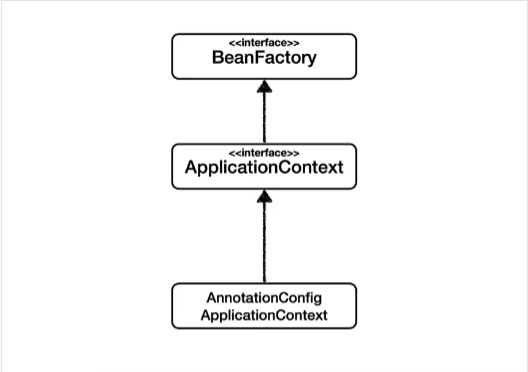
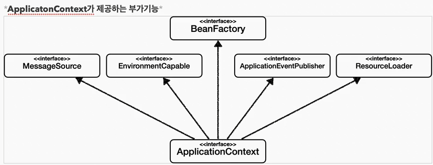
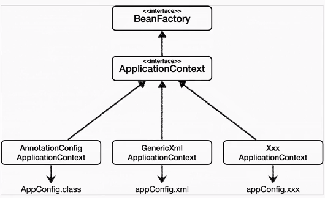

# 스프링 컨테이너와 스프링 빈

## 스프링 컨테이너 생성

```java
//스프링 컨테이너 생성
ApplicationContext applicationContext = 
                new AnnotationConfigApplicationContext(AppConfig.class);
```

- ApplicationContext : 스프링 컨테이너, 인터페이스
- 스프링 컨테이너는 XML을 기반으로 만들 수 있고, 어노테이션 기반의 자바 설정을 클래스로 만들 수 있다
- 직전에 AppConfig를 사용했던 방식이 어노테이션 기반의 자바 설정 클래스로 스프링 컨테이너를 만든 것이다.
- 참고 : 더 정확히는 스프링 컨테이너를 부를 때, BeanFactory, ApplicationContext 로 구분해서 이야기한다. BeanFactory 를 직접 사용하는 경우는 거의 없으므로 일반적으로 ApplicationContext 를 스프링 컨테이너라 한다.
- new AnnotationConfigApplicationContext(AppConfig.class)
- 스프링 컨테이너를 생성할 때는 구성정보(AppConfig.class)를 지정해줘야한다.
- **빈 이름**은 메서드 이름을 사용한다. 직접 부여할 수 있다 @Bean(name-"memberService)
- 주의 : 빈 이름은 항상 다름 이름을 부여 해야 한다. 같은 이름을 부여하면, 다른 빈이 무시되거나 기존 빈을 덮어버리는 등 오류 발생
- 스프링 컨테이너는 **빈 객체**의 파라미터로 넘어오는 설정 정보를 참고해서 의존관계를 주입한다. 


```java

@Configuration // @Configuration : 애플리케이션의 구성과 설정 정보
public class AppConfig {

    @Bean // 스프링 빈 등록하고 의존관계 설정
    public MemberService memberService() { // 빈 이름
        // 빈 객체(설정 정보)
        return new MemberServiceImpl(memberRepository());
    }

    @Bean
    public MemberRepository memberRepository() {
        return new MemoryMemberRepository();
    }

    @Bean
    public OrderService orderService() {
        return new OrderServiceImpl(memberRepository(), discountPolicy());
    }

    @Bean
    public DiscountPolicy discountPolicy() {
        return new RateDiscountPolicy();
    }
}
```
---
## 스프링 빈 조회 - 기본

- AnnotationConfigApplicationContext ac = new AnnotationConfigApplicationContext(AppConfig.class);
- ac.getBean(빈 이름, 타입)
- ac.getBean(타입)
- 조회 대상스프링 빈이 없으면 예외 발생
  - NoSuchBeanDefinitionException: No Bean named 'xxxx' available


```java
@Test
    @DisplayName("빈 이름으로 조회")
    void findBeanByName() {
        // 인터페이스로 조회하면 인터페이스의 구현체가 조회 대상이 됨
        MemberService memberService = ac.getBean("memberService", MemberService.class);
        assertThat(memberService).isInstanceOf(MemberServiceImpl.class);
//        System.out.println("memberService = " + memberService);
//        System.out.println("memberServive.getClass() = " + memberService.getClass());
    }

    @Test
    @DisplayName("이름 없이 타입으로만 조회")
    void findBeanByType() {
        MemberService memberService = ac.getBean(MemberService.class);
        assertThat(memberService).isInstanceOf(MemberServiceImpl.class);
    }

    @Test
    @DisplayName("구체 타입으로 조회")
    void findBeanByName2() {
        MemberServiceImpl memberService = ac.getBean("memberService", MemberServiceImpl.class);
        assertThat(memberService).isInstanceOf(MemberServiceImpl.class);
    }

    @Test // 예외
    @DisplayName("빈 이름으로 조회X")
    void findBeanByNameX() {
        // ac.getBean("xxxx", MemberService.class);
        // 아래에 있는 로직을 실행하면 위쪽에 있는 예외가 터져야 한다
        assertThrows(NoSuchBeanDefinitionException.class,
                () -> ac.getBean("xxxx", MemberService.class));
    }
```
---

## 스프링 빈 조회 - 동일한 타입이 둘 이상

- 타입으로 조회 시 같은 타입의 스프링 빈이 둘 이상이면 오류발생. 이때는 빈 이름을 지정하자
- ac.getBeanOfType() 을 사용하면 해당 타입의 모든 빈을 조회할 수 있다.

```java
class ApplicationContextSameBeanFindTest {

    AnnotationConfigApplicationContext ac = new AnnotationConfigApplicationContext(SameBeanConfig.class);

    @Test
    @DisplayName("타입으로 조회 시 같은 타입이 둘 이상 있으면, 중복 오류가 발생한다")
    void findBeanByTypeDuplicate() {
        assertThrows(NoUniqueBeanDefinitionException.class,
                () -> ac.getBean(MemberRepository.class));
    }

    @Test
    @DisplayName("타입으로 조회 시 같으 타입이 둘 이상 있으면, 빈 이름을 지정하면 된다")
    void findBeanByName() {
        MemberRepository memberRepository = ac.getBean("memberRepository1", MemberRepository.class);
        assertThat(memberRepository).isInstanceOf(MemberRepository.class);
    }

    @Test
    @DisplayName("특정 타입을 모두 조회하기")
    void findAllBeanByType() {
        Map<String, MemberRepository> beansOfType = ac.getBeansOfType(MemberRepository.class);
        for (String key : beansOfType.keySet()) {
            System.out.println("key = " + key + " value = " + beansOfType.get(key));
        }
        System.out.println("beansOfType = " + beansOfType); // key value로 출력
        assertThat(beansOfType.size()).isEqualTo(2);
    }


    @Configuration
    static class SameBeanConfig {
        // 빈 이름이 다르고 인스턴스 타입이 같을 수 있음
        @Bean
        public MemberRepository memberRepository1() {
            return new MemoryMemberRepository();
        }

        @Bean
        public MemberRepository memberRepository2() {
            return new MemoryMemberRepository();
        }
    }
}
```

---

## 스프링 빈 조회 - 상속관계

- **부모 타입으로 조회하면, 자식 타입도 함께 조회한다**
- 그래서 모든 자바 객체의 최고 부모인 Object 타입으로 죟하면, 모든 스프링 빈을 조회한다

```java
class ApplicationContextExtendsFindTest {

    AnnotationConfigApplicationContext ac = new AnnotationConfigApplicationContext(TestConfig.class);

    @Test
    @DisplayName("부모 타입으로 모두 조회하기")
    void findAllBeanByParentType() {
        Map<String, DiscountPolicy> beansOfType = ac.getBeansOfType(DiscountPolicy.class);
        assertThat(beansOfType.size()).isEqualTo(2);
        for (String key : beansOfType.keySet()) {
            System.out.println("key = " + key + " value = " + beansOfType.get(key));
        }
    }

    @Test
    @DisplayName("부모 타입으로 모두 조회하기 - Object")
    void findAllBeanByObjectType() {
        Map<String, Object> beansOfType = ac.getBeansOfType(Object.class);
        // 스프링 내부적으로 사용하는 빈 까지 다 출력됨
        for (String key : beansOfType.keySet()) {
            System.out.println("key = " + key + " value = " + beansOfType.get(key));
        }
    }

    @Configuration
    static class TestConfig {
        @Bean
        public DiscountPolicy rateDiscountPolicy() {
            return new RateDiscountPolicy();
        }

        @Bean
        public DiscountPolicy fixDiscountPolicy(){
            return new FixDisocuntPolicy();
        }
    }
}
```

> *사실 스프링 빈 조회는 거의 쓰지 않지만, 부모 타입으로 조회시 자식이 어디까지 조회되나 알아야 자동 의존관계 주입할때 문제없이 해결 가능*


---

## BeanFactory 와 ApplicationContext



> BeanFactory
- 스프링 컨테이너의 최상위 인터페이스, 스프링 빈을 관리하고 조회하는 역할
- getBean() 제공
- 지금까지 사용했던 대부분의 기능은 BeanFactory가 제공하는 기능

> ApplicationContext
- BeanFactory 기능을 모두 상속받아서 제공
- BeanFactory와의 차이는, 애플리케이션 개발할 때는 빈을 관리하고 조회하는 기능외에도 수 많은 부가기능 필요


- 메세지 소스를 활용한 국제화 기능
  - 예를 들어 한국에서 들어오면 한국어로, 영어권에서 들어오면 영어로 출력
- 환경변수
  - 로컬, 개발(테스트), 운영(실제 프로덕션) 등을 구분해서 처리
- 애플리케이션 이벤트
  - 이벤트를 발행하고 구독하는 모델을 편리하게 지원
- 편리한 리소스 조회
  - 파일, 클래스패스, 외부 등에서 리소스를 편리하게 조회

#### *BeanFactory나 ApplicationContext를 스프링 컨테이너라 한다*

##  다양한 설정 형식 지원 - 자바코드, XML
https://spring.io/projects/spring-framework

- 최근에는 스프링 부트를 많이 사용하면서 XML기반의 설정은 잘 사용하지 않는다.
- 하지만 아직 많은 레거시 프로젝트들이 XML로 되어있고, 또 XML을 사용하면 컴파일 없이 빈 설정 정보를 변경할 수 있는 장점도 있으니 한번쯤 배워두는 것도 괜찮다.
- GenericXmlApplicationContext를 사용하면서 XML 설정 정보를 넘기면 된다.

> - resources 하위에 appConfig.xml 파일 작성 = AppConfig 파일과 일치
```java
<?xml version="1.0" encoding="UTF-8"?>
<beans xmlns="http://www.springframework.org/schema/beans"
       xmlns:xsi="http://www.w3.org/2001/XMLSchema-instance"
       xsi:schemaLocation="http://www.springframework.org/schema/beans http://www.springframework.org/schema/beans/spring-beans.xsd">

    <bean id="memberService" class="hello.core.member.MemberServiceImpl">
        <!--생성자 (AppConfig에서 스프링 빈으로 등록한 거랑 똑같은 기능-->
        <constructor-arg name="memberRepository" ref="memberRepository" />
    </bean>

    <bean id="memberRepository" class="hello.core.member.MemoryMemberRepository"/>

    <bean id="orderSerivce" class="hello.core.order.OrderServiceImpl">
        <constructor-arg name="memberRepository" ref="memberRepository"/>
        <constructor-arg name="discountPolicy" ref="discountPolicy"/>

    </bean>

    <bean id="discountPolicy" class="hello.core.discount.RateDiscountPolicy"/>
</beans>
```

```java
public class XmlAppContext {

  @Test
  void xmlAppContex() {
    ApplicationContext ac = new GenericXmlApplicationContext("appConfig.xml");
    MemberService memberService = ac.getBean("memberService", MemberService.class);
    assertThat(memberService).isInstanceOf(MemberService.class);

  }
}
```

