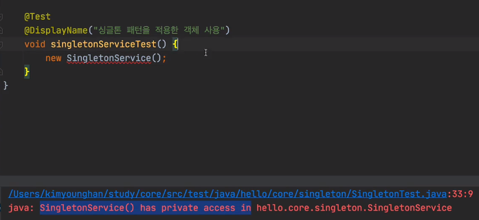
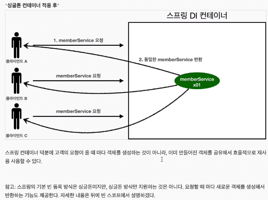

# 싱글톤 컨테이너

## 웹 애플리케이션과 싱글톤


- 기존에 만들었던 스프링 없는 순수한 DI 컨테이너의 AppConfig는 요청을 할 때마다 객체를 새로 생성한다.
- 고객 트래픽이 초당 100이 나오면 초당 100개 객체가 생성되고 소멸된다! -> **메모리 낭비 심함**
- 해결방안은 해당 객체가 딱 1개만 생성되고, 공유하도록 설계하면 된다. -> **싱글톤 패턴**

## 싱글톤 패턴
- 클래스의 인스턴스가 딱 1개만 생성되는 것을 보장하는 디자인 패턴이다.
  - 하나 자바 서버(하나의 JVM)에 객체 인스턴스가 딱 1개만 생성된다
- 그래서 객체 인스턴스를 2개 이상 생성하지 못하도록 막아야한다.
- 아래 코드는 객체를 미리 생성해두는 가장 단순하고 안전한 방법이다.
  - 객체가 생성 안되어있으면 그제서야 생성하고, 생성이 되어있으면 그걸 쓰는 '지연'방식도 있는데, 객체 인스턴스가 메모리를 많이 잡아먹는게 아니면 로딩할때 미리 생성하는 이 방법이 안전하다.

```java
public class SingleTonService {
    // 1. static 영역에 객체를 딱 1개만 생성한다.
    private static final SingleTonService instance = new SingleTonService();

    // 2. public으로 열어서 객체 인스턴스가 필요하면 이 static 메서드를 통해서만 조회하도록 허용한다.
    // 이 메서드를 호출하면 항상 같은 인스턴스를 반환한다.
    public static SingleTonService getInstance() {
        return instance;
    }

    // 3. 생성자를 private으로 선언해서 외부에서 new 키워드를 사용한 객체 생성을 못하게 막는다.
    private SingleTonService() {
    }

    public void logic(){
        System.out.println("싱글톤 객체 로직 호출");
    }
}
```
1. static 영역에서 객체 instance 를 미리 하나 생성해서 올려둔다.
2. 이 객체 인스턴스가 필요하면 오직 getInstance() 메서드를 통해서만 조회할 수 있다. 이 메서드를 호출하면 항상 같은 인스턴스를 반환한다.
3. 딱 1개의 객체 인스턴스만 존재해야 하므로, **생성자**를 **private**으로 막아서 혹시라도 외부에서 new 키워드로 객체 인스턴스가 생성되는 것을 막는다.

-> SingleTonService를 생성할 수 있는 곳은 아무 곳도 없다.


> 싱글톤 패턴 문제점
- 싱글톤 패턴을 구현하는 코드 자체가 많이 들어간다.
- 의존관계상 클라이언트가 구체 클래스에 의존한다. -> DIP를 위반한다.
  - ex) memberServiceImpl.getInstance() 이런식으로 불러와야 한다.
- 클라이언트가 구체 클래스에 의존해서 OCP 원칙을 위반할 가능성이 높다.
- 테스트하기 어렵다.
- 내부 속성을 변경하거나 초기화 하기 어렵다.
- private 생성자로 자식 클래스를 만들기 어렵다.
- 결론적으로 유연성이 떨어진다.
  - DI 하기가 어렵다
- 안티패턴으로 불리기도 한다.

## 싱글톤 컨테이너
- 스프링 컨테이너는 싱글톤 패턴의 문제점을 해결하고, 객체 인스턴스를 싱글톤(1개만 생성)으로 관리한다.
  - DIP, OCP, 테스트, private 생성자로부터 자유롭게 싱글톤을 사용 
  - 컨테이너 생성 과정을 다시 살펴보면, 컨테이너는 개체를 하나만 생성해서 관리한다.
- 스프링 빈이 바로 싱글톤으로 관리되는 빈이다.
- 스프링 컨테이너는 싱글톤 컨테이너 역할을 한다. 이렇게 싱글톤 객체를 생성하고 관리하는 기능을 싱글톤 레지스트리라 한다.


## 싱글톤 방식의 주의점
- 싱글톤 패턴이든, 스프링 같은 싱글톤 컨테이너를 사용하든, 객체 인스턴스를 하나만 생성해서 공유하는 싱글톤 방식은 여러 클라이언트가 하나의 같은 객체 인스턴스를 공유하기 때문에 싱글톤 객체는 상태를 유지(stateful)하게 설계하면 안된다.
- 무상태(stateless)로 설계해야 한다!
  - 특정 클라이언트에 의존적인 필드가 있으면 안된다.
  - 특정 클라이언트가 값을 변경할 수 있는 필드가 있으면 안된다
  - 가급적 읽기만 가능해야 한다. 수정x
  - 필드 대신에 자바에서 공유디지 않는 지역변수, 파라미터, threadLocal 등을 사용해야 한다
    -스프링 빈의 필드에 공유 값을 설정하면 정말 큰 장애가 발생할 수 있다!!! 
```java

public class StatefulService {

  private int price; // 상태를 유지하는 필드
  public void order(String name, int price) {
    System.out.println("name = " + name + " price = " + price);
    this.price = price; // 여기가 문제!!
  }

  public int getPrice() {
    return price;
  }
}

```
- 위 예제에 상태를 유지하는 필드가 있다. (private int price)

```java
class StatefulServiceTest {

    @Test
    void statefulServiceSingleton() {
        AnnotationConfigApplicationContext ac = new AnnotationConfigApplicationContext(TestConfig.class);
        StatefulService statefulService1 = ac.getBean(StatefulService.class);
        StatefulService statefulService2 = ac.getBean(StatefulService.class);

        // TreadA : A사용자 10000 원 주문
        statefulService1.order("userA", 10000);
        // TreadB : B사용자 20000 원 주문
        statefulService1.order("userB", 20000);

        //TreadA : 사용자A 주문 금액 조회
        int price = statefulService1.getPrice();
        System.out.println("price = " + price); // 같은 인스턴스를 사용해서 변수이름이 달라서 똑같은 애가 나온다

        assertThat(statefulService1.getPrice()).isEqualTo(20000);
    }

    static class TestConfig {

        @Bean
        public StatefulService statefulService() {
            return new StatefulService();
        }
    }

}
```
- 위의 예제는 최대한 단순히 설명하기 위해, 실제 쓰레드는 사용하지 않았다.
-  ThreadA가 사용자 A코드를 호출하고 ThreadB가 사용자B 코드를 호출한다 가정하자.
- StatefulService의 Price필드는 공유되는 필드인데, 특정 클라이언트가 값을 변경한다.
- 사용자A주문 금액은 10000원이어야 하는데, 20000원이라는 결과가 나왔다.
- 실무에서 이런 경우를 종종 보는데, 이로인해 정말 해결하기 어려운 큰 무넺들이 터진다.(몇년에 한번씩 꼭 만난다)
- 진짜 공유 필드는 조심해야한다! **스프링 빈은 항상 무상태(stateless)로 설계하자**

#### 예시 > 내 결제 내역 페이지에서 다른 사람 결제 내역이 보일 수 있다. 내 계정인데 다른 사람 이름이 보일 수 있다. -> 로그 다 까서 복구 해야 하기 때문에 오래 걸린다

> 공유 필드가 아닌 지역 변수를 사용해라

```java
public class StatefulService {

//    private int price; // 상태를 유지하는 필드
  
    public int order(String name, int price) {
        System.out.println("name = " + name + " price = " + price);
        return price;
    }
}
```

```java
class StatefulServiceTest {

    @Test
    void statefulServiceSingleton() {
        AnnotationConfigApplicationContext ac = new AnnotationConfigApplicationContext(TestConfig.class);
        StatefulService statefulService1 = ac.getBean(StatefulService.class);
        StatefulService statefulService2 = ac.getBean(StatefulService.class);

        // TreadA : A사용자 10000 원 주문
        int userAPrice = statefulService1.order("userA", 10000);
        // TreadB : B사용자 20000 원 주문
        int userBPrice = statefulService1.order("userB", 20000);

        //TreadA : 사용자A 주문 금액 조회
        System.out.println("price = " + userAPrice);

    }

    static class TestConfig {

        @Bean
        public StatefulService statefulService() {
            return new StatefulService();
        }
    }

}
```
