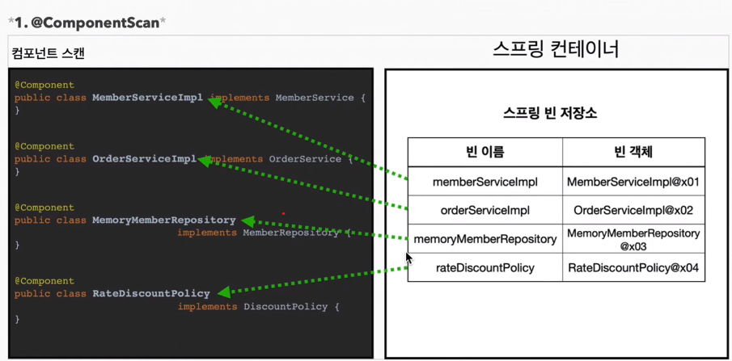
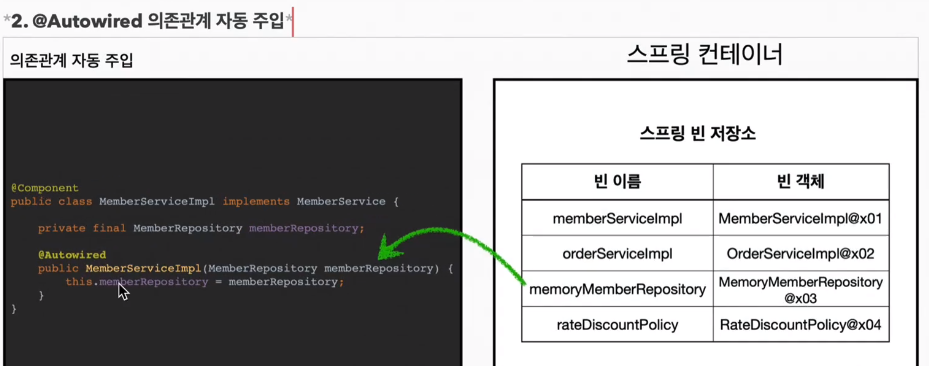

# 컴포넌트 스캔

## 컴포넌트 스캔과 의존관계 자동 주입 시작하기
- 지금까지 스프링 빈을 등록할 때는 자바 코드의 @Bean이나 XML의 <bean> 등을 통해서 설정 정보에 직접 등록할 스프링 빈을 나열했다.
- 예제에서는 몇개가 안되었지만, 이렇게 등록해야할 스프링 빈이 수십, 수백개가 되면 일일이 등록하기도 귀찮고, 설정정보도 커지고, 누락하는 문제가 발생한다.
- 그래서 스프링은 설정 정보가 없어도 자동으로 스프링 빈을 등록하는 컴포넌트 스캔이라는 기능을 제공한다.
- 또 의존관계도 자동으로 주입하는 @Autowired 라는 기능도 제공한다

```java
@Configuration
@ComponentScan(
        excludeFilters = @ComponentScan.Filter(type = FilterType.ANNOTATION, classes = Configuration.class)
)
public class AutoAppConfig {
}

```
- 컴포넌트 스캔을 사용하려면 먼저 @ComponentScan을 설정 정보에 붙여주면 된다
- 기존의 AppConfig(수동등록)와는 다르게 @Bean으로 등록한 클래스가 하나도 없다!

> 참고 : 컴포넌트 스캔을 사용하면 @Configuration 이 붙은 설정 정보도 자동으로 등록되기 때문에, AppConfig, TestConfig 등 앞서 만들어두었던 설정 정보도 함께 등록되고, 실행되어 버린다.
그래서 excludeFilters를 이용해서 설정 정보는 컴포넌트 스캔 대상에서 제외했다. 보통 설정 정보를 컴포넌트 스캔 대상에서 제외하지는 않지만, 기존 예제 코드를 최대한 남기고 유지하기 위해서 이 방법 사용

- 컴포넌트 스캔은 이름 그대로 @Component 애노테이션이 붙은 클래스를 스캔해서 스프링 빈으로 등록
> 참고 : @Configuration 이 컴포넌트 스캔의 대상이 된 이유도 @Configuration 소스 코드를 열어보면 @Component 스캔이 붙어있기 때문이다,

```java
@Component
public class MemberServiceImpl implements MemberService {

    private final MemberRepository memberRepository;

    // ac.getBean(MemberRepository.class)
    @Autowired // 의존관계 자동 주입 : 생성자에 @Autowired를 지정하면, 스프링 컨테이너가 자동으로 해당 스프링 빈을 찾아서 주입한다.
    public MemberServiceImpl(MemberRepository memberRepository) {
        this.memberRepository = memberRepository;
    }
    ...
}
```
- 이전에는 AppConfig에서는 @Bean으로 직접 설정 정보를 작성했고, 의존관계도 직접 명시했다. 이제는 이런 설정 정보 자체가 없기 때문에, 의존관계 주입도 이 클래스 안에서 해결해야 한다.
- @Autowired 는 의존관계를 자동으로 주입해준다
- 로그를 잘 보면 컴포넌트 스캔이 잘 동작하는 것을 확인 할 수 있다.
```text
ClassPathBeanDefinitionScanner - Identified candidate component class: file [C:\Users\admin\Downloads\study\core\out\production\classes\hello\core\discount\RateDiscountPolicy.class]
ClassPathBeanDefinitionScanner - Identified candidate component class: file [C:\Users\admin\Downloads\study\core\out\production\classes\hello\core\member\MemberServiceImpl.class]
ClassPathBeanDefinitionScanner - Identified candidate component class: file [C:\Users\admin\Downloads\study\core\out\production\classes\hello\core\member\MemoryMemberRepository.class]
ClassPathBeanDefinitionScanner - Identified candidate component class: file [C:\Users\admin\Downloads\study\core\out\production\classes\hello\core\order\OrderServiceImpl.class]
- Creating shared instance of singleton bean 'org.springframework.context.event.internalEventListenerProcessor'
- Creating shared instance of singleton bean 'org.springframework.context.event.internalEventListenerFactory'
- Creating shared instance of singleton bean 'org.springframework.context.annotation.internalAutowiredAnnotationProcessor'
- Creating shared instance of singleton bean 'org.springframework.context.annotation.internalCommonAnnotationProcessor'
- Creating shared instance of singleton bean 'autoAppConfig'
- Creating shared instance of singleton bean 'rateDiscountPolicy'
- Creating shared instance of singleton bean 'memberServiceImpl'
- Creating shared instance of singleton bean 'memoryMemberRepository'
- Autowiring by type from bean name 'memberServiceImpl' via constructor to bean named 'memoryMemberRepository'
- Creating shared instance of singleton bean 'orderServiceImpl'
- Autowiring by type from bean name 'orderServiceImpl' via constructor to bean named 'memoryMemberRepository'
- Autowiring by type from bean name 'orderServiceImpl' via constructor to bean named 'rateDiscountPolicy'
```


- 스프링 빈으로 등록할때 스프링 빈의 기본 이름은 클래스명을 사용하되 맨 앞글자만 소문자를 사용
  - 빈 이름 기본 전략 :  MemberServiceImpl 클래스 -> memberServiceImpl
  - 빈 이름 직접 지정 :  만약 스프링 빈의 이름을 직접 지정하고 싶으면 @Component("memberSerivce2) 이런식으로 이름 부여


- 생성자에 @Autowired 를 지정하면, 스프링 컨테이너가 자동으로 해당 스프링 빈을 찾아서 주입한다.
- 이때 기본 조회 전략은 타입이 같은 빈을 찾아서 주입한다
  - getBean(MemberRepository.class)와 동일