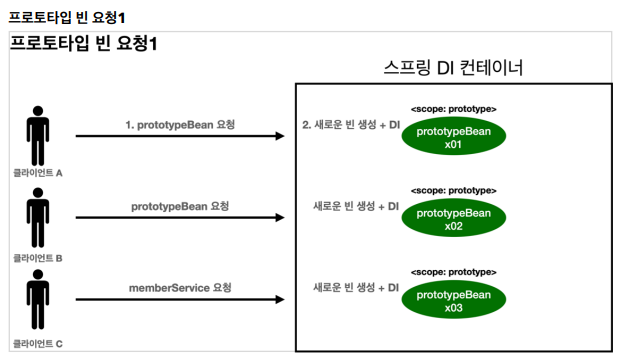
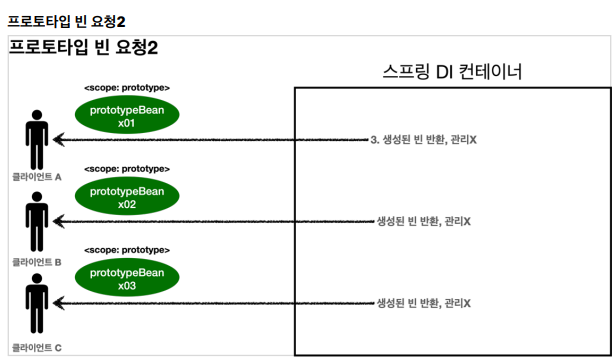

#빈 스코프

# 빈 스코프란?
지금까지 우리는 스프링이 빈에 스플이 컨테이너의 시작과 함께 생성되어 스프링 컨테이너가 종료될 때 까지 유지된다고 학습했다.
이것은 스프링 빈이 기본적으로 **싱글톤 스코프**로 생성되기 때문이다.
스코크는 번역 그대로 빈이 존재할 수 있는 범위를 뜻한다.

- **싱글톤** : 기본 스코프, 스프링 컨테이너의 시작과 종료까지 유지되는 가장 넒은 범위의 스코프
- **프로토 타입** : 스프링 컨테이너에는 프로토 타입 빈의 생성과 의존관계 주입, 초기화 메소드까지만 관여하고 더는 관리하지 않는 매우 짧은 범위의 스코프다
- **웹 관련 스코프**
  - **request** : 웹 요청이 들어오고 나갈때 까지 유지되는 스코프
  - **session** : 웹 세션이 생성되고 종료될 때까지 유지되는 스코프
  - **application** : 웹의 서블릿 컨텍스와 같은 범위로 유지되는 스코프

**컴포넌트 스캔 자동 등록**
```java
@Scope("prototype")
@Component
public class HelloBean {}
```

**수동 등록**
```java
@Scope("prototype")
@Bean
PrototypeBean HelloBean() {
 return new HelloBean();
}
```

지금까지 싱글톤 스코프를 계속 사용해보았으니, 프로토타입 스코프부터 확인해보자

## 프로토 타입 스코프

싱글톤 스코프의 빈을 조회하면 스프링 컨테이너는 항상 같은 인스턴스의 스프링 빈을 반환한다. 반면에
프로토타입 스코프를 스프링 컨테이너에 조회하면 스프링 컨테이너는 항상 새로운 인스턴스를 생성해서
반환한다



- **핵심은 스프링 컨테이너는 프로토타입 빈을 생성하고, 의존관계 주입, 초기화까지만 처리한다**는
것이다. 
- 클라이언트에 빈을 반환하고, 이후 스프링 컨테이너는 생성된 프로토타입 빈을 관리하지 않는다.
- 프로토타입 빈을 관리할 책임은 프로토타입 빈을 받은 클라이언트에 있다. 
- 그래서 ```@PreDestroy``` 같은 종료 메서드가 호출되지 않는다

> 싱글톤 스코프 빈 테스트

```java

public class SingletonTest {
    
    @Test
    void singletonBeanFind() {
        AnnotationConfigApplicationContext ac = new AnnotationConfigApplicationContext(SingletonBean.class);
        SingletonBean singletonBean1 = ac.getBean(SingletonBean.class);
        SingletonBean singletonBean2 = ac.getBean(SingletonBean.class);
        System.out.println("singletonBean1 = " + singletonBean1);
        System.out.println("singletonBean2 = " + singletonBean2);
        Assertions.assertThat(singletonBean1).isSameAs(singletonBean2);

        ac.close();
    }
    
    @Scope("singleton")
    static class SingletonBean {
        @PostConstruct
        public void init() {
            System.out.println("SingletonBean.init");
        }

        @PreDestroy
        public void destroy() {
            System.out.println("SingletonBean.destroy");
        }
    }
}
```

```text
SingletonBean.init
singletonBean1 = hello.core.scope.SingletonTest$SingletonBean@66c92293
singletonBean2 = hello.core.scope.SingletonTest$SingletonBean@66c92293
22:46:08.692 [main] DEBUG org.springframework.context.annotation.AnnotationConfigApplicationContext - Closing org.springframework.context.annotation.AnnotationConfigApplicationContext@4b8ee4de, started on Sat May 13 22:46:08 KST 2023
SingletonBean.destroy
```

> 프로토타입 스코프 빈 테스트

```java

public class PrototypeTest {

    @Test
    void prototypeBeanFind() {
        // @Component 를 PrototypeBean클래스에 안붙여도 아래줄처럼 빈을 넣어버리면 컴포넌트 스캔 대상이라고 봐서 안붙여도 됨
        AnnotationConfigApplicationContext ac = new AnnotationConfigApplicationContext(PrototypeBean.class);
        System.out.println("find prototypeBean1");
        PrototypeBean prototypeBean1 = ac.getBean(PrototypeBean.class);
        System.out.println("find prototypeBean2");
        PrototypeBean prototypeBean2 = ac.getBean(PrototypeBean.class);
        System.out.println("prototypeBean1 = " + prototypeBean1);
        System.out.println("prototypeBean2 = " + prototypeBean2);
        assertThat(prototypeBean1).isNotSameAs(prototypeBean2);

        ac.close();
    }

    @Scope("prototype")
    static class PrototypeBean {
        @PostConstruct
        public void init() {
            System.out.println("PrototypeBean.init");
        }

        @PreDestroy
        public void destroy() {
            System.out.println("PrototypeBean.destroy");
        }
    }
}
```
```text
find prototypeBean1
PrototypeBean.init
find prototypeBean2
PrototypeBean.init
prototypeBean1 = hello.core.scope.PrototypeTest$PrototypeBean@66c92293
prototypeBean2 = hello.core.scope.PrototypeTest$PrototypeBean@332796d3
08:48:47.633 [main] DEBUG org.springframework.context.annotation.AnnotationConfigApplicationContext - Closing org.springframework.context.annotation.AnnotationConfigApplicationContext@4b8ee4de, started on Sun May 14 08:48:47 KST 2023
```


- 싱글톤 빈은 스프링 컨테이너 생성 시점에 초기화 메서드가 실행되지만, 프로토타입 스코프의 빈은 스프링 컨테이너에서 빈을 조회할 때 생성되고, 초기화 메서드도 실행된다.
- 프로토타입 빈을 2번 조회했으므로 완전히 다른 스프링 빈이 생성되고, 초기화도 2번 실행된 것을 확인할
  수 있다.
- 싱글톤 빈은 스프링 컨테이너가 관리하기 때문에 스프링 컨테이너가 종료될 때 빈의 종료 메서드가
  실행되지만, 프로토타입 빈은 스프링 컨테이너가 생성과 의존관계 주입 그리고 초기화 까지만 관여하고,
  더는 관리하지 않는다. 따라서 프로토타입 빈은 스프링 컨테이너가 종료될 때 @PreDestroy 같은 종료
  메서드가 전혀 실행되지 않는다.


```java
    @Test
    void prototypeBeanFind() {
        AnnotationConfigApplicationContext ac = new AnnotationConfigApplicationContext(PrototypeBean.class);
        System.out.println("find prototypeBean1");
        PrototypeBean prototypeBean1 = ac.getBean(PrototypeBean.class);
        System.out.println("find prototypeBean2");
        PrototypeBean prototypeBean2 = ac.getBean(PrototypeBean.class);
        System.out.println("prototypeBean1 = " + prototypeBean1);
        System.out.println("prototypeBean2 = " + prototypeBean2);
        assertThat(prototypeBean1).isNotSameAs(prototypeBean2);

        prototypeBean1.destroy(); // 직접 수동 호출
        prototypeBean2.destroy(); // 직접 수동 호출
        ac.close();
    }
```

> 프로토타입 빈의 특징 정리
>
> - 스프링 컨테이너에 요청할 때 마다 새로 생성된다
> - 스프링 컨테이너는 프로토타입 빈의 생성과 의존관계 주입 그리고 초기화까지만 관여한댜
> - 종료 메서드가 호출되지 않는다
> - 그래서 프로토타입 빈은 프로토타입 빈을 조회한 클라이언트가 관리해야 한다. 종료 메서드에 대한 호출도
    클라이언트가 직접 해야한다


## 프로토타입 스코프 - 싱글톤 빈과 함께 사용시 문제점

스프링은 일반적으로 싱글톤 빈을 사용하므로, 싱글톤 빈이 프로토타입 빈을 사용하게 된다.
그런데 싱글톤 빈은 생성 시점에만 의존 관계 주입을 받기 때문에, 프로토타입 빈이 새로 생성되기는 하지만, 싱글톤 빈과 함께 계속 유지되는것이 문제다

프로토타입 빈을 주입 시점에만 새로 생성하는게 아니라, 사용할 때 마다 새로 생성해서 사용하는 것을 원할 경우 문제!!
이럴거면 싱글톤을 사용하지 뭐하러 프로토타입을 쓰겠는가? 개발자가 의도한게 아니다!

```java

public class SingletonWithPrototypeTest1 {

    @Test
    void prototypeFind() {
        AnnotationConfigApplicationContext ac = new AnnotationConfigApplicationContext(PrototypeBean.class);
        PrototypeBean prototypeBean1 = ac.getBean(PrototypeBean.class);
        prototypeBean1.addCount();
        Assertions.assertThat(prototypeBean1.getCount()).isEqualTo(1);

        PrototypeBean prototypeBean2 = ac.getBean(PrototypeBean.class);
        prototypeBean2.addCount();
        Assertions.assertThat(prototypeBean2.getCount()).isEqualTo(1);
    }

    @Test
    void singletonClientUsePrototype() {
        AnnotationConfigApplicationContext ac =
                new AnnotationConfigApplicationContext(ClientBean.class, PrototypeBean.class);
        ClientBean clientBean1 = ac.getBean(ClientBean.class);
        int count1 = clientBean1.logic();
        Assertions.assertThat(count1).isEqualTo(1);

        ClientBean clientBean2 = ac.getBean(ClientBean.class);
        int count2 = clientBean2.logic();
        Assertions.assertThat(count2).isEqualTo(2);


    }

    @Scope("singleton")
    static class ClientBean {
        private final PrototypeBean prototypeBean; // 생성 시점에 주입. 그래서 계속 같은 걸 사용

        @Autowired
        public ClientBean(PrototypeBean prototypeBean) {
            this.prototypeBean = prototypeBean;
        }

        public int logic() {
            prototypeBean.addCount();
            return prototypeBean.getCount();
        }
    }


    @Scope("prototype")
    static class PrototypeBean {
        private int count = 0;

        public void addCount() {
            count++;
        }

        public int getCount() {
            return count;
        }

        @PostConstruct
        public void init() {
            System.out.println("PrototypeBean.init " + this);
        }

        @PreDestroy
        public void destroy() {
            System.out.println("PrototypeBean.destroy ");
        }
    }
}
```

> - 참고 : 여러 빈에서 같은 프로토타입 빈을 주입 받으면, **주입 받는 시점에 각각 새로운 프로토타입 빈이 생성** 된다.
>   - 예를 들어서 clientA, clientB 가 각각 의존관계 주입을 받으면 각각 다른 인스턴스의 프로토타입 빈을 주입 받는다.
>   - clientA -> prototypeBean@x01
>   - clientB -> prototypeBean@x02
> - 물론 사용할 때 마다 새로 생성되는 것은 아니다


```java

public class SingletonWithPrototypeTest1 {

    @Test
    void prototypeFind() {
        AnnotationConfigApplicationContext ac = new AnnotationConfigApplicationContext(PrototypeBean.class);
        PrototypeBean prototypeBean1 = ac.getBean(PrototypeBean.class);
        prototypeBean1.addCount();
        Assertions.assertThat(prototypeBean1.getCount()).isEqualTo(1);

        PrototypeBean prototypeBean2 = ac.getBean(PrototypeBean.class);
        prototypeBean2.addCount();
        Assertions.assertThat(prototypeBean2.getCount()).isEqualTo(1);
    }

    @Test
    void singletonClientUsePrototype() {
        AnnotationConfigApplicationContext ac =
                new AnnotationConfigApplicationContext(ClientBean.class, PrototypeBean.class);
        ClientBean clientBean1 = ac.getBean(ClientBean.class);
        int count1 = clientBean1.logic();
        Assertions.assertThat(count1).isEqualTo(1);

        ClientBean clientBean2 = ac.getBean(ClientBean.class);
        int count2 = clientBean2.logic();
        Assertions.assertThat(count2).isEqualTo(1);


    }

    @Scope("singleton")
    static class ClientBean {
      //  private final PrototypeBean prototypeBean; // 생성 시점에 주입. 그래서 계속 같은 걸 사용
        @Autowired
        ApplicationContext applicationContext;

//        @Autowired
//        public ClientBean(PrototypeBean prototypeBean) {
//            this.prototypeBean = prototypeBean;
//        }

        public int logic() {
            PrototypeBean prototypeBean = applicationContext.getBean(PrototypeBean.class);
            prototypeBean.addCount();
            return prototypeBean.getCount();
        }
    }


    @Scope("prototype")
    static class PrototypeBean {
        private int count = 0;

        public void addCount() {
            count++;
        }

        public int getCount() {
            return count;
        }

        @PostConstruct
        public void init() {
            System.out.println("PrototypeBean.init " + this);
        }

        @PreDestroy
        public void destroy() {
            System.out.println("PrototypeBean.destroy ");
        }
    }
}
```
```text
PrototypeBean.init hello.core.scope.SingletonWithPrototypeTest1$PrototypeBean@34c01041
PrototypeBean.init hello.core.scope.SingletonWithPrototypeTest1$PrototypeBean@562951
```
- 이렇게 사용해도 프로토타입 빈이 새로 생겨서 의도한 대로 사용가능하지만, 스프링이 애플리케이션 컨텍스트를 클라이언트단으로 가져오는건 너무 지저분하다
- 너무 스프링에 의존적인 코드가 된다