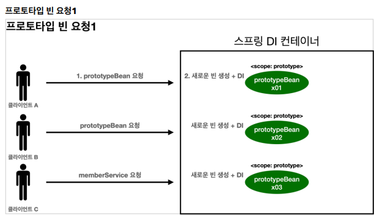
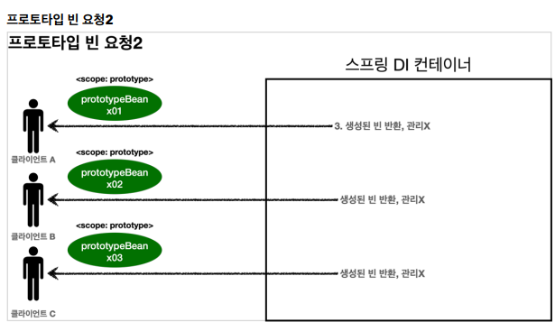
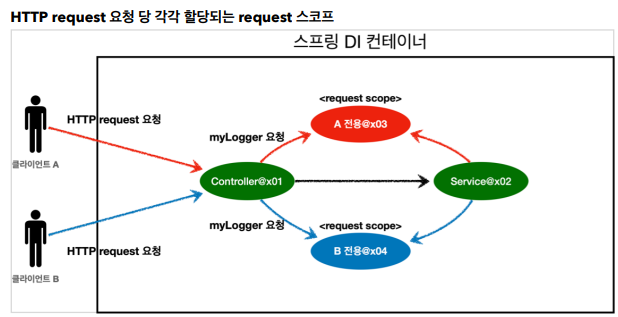
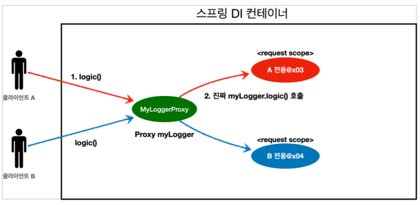

#빈 스코프

# 빈 스코프란?
지금까지 우리는 스프링이 빈에 스플이 컨테이너의 시작과 함께 생성되어 스프링 컨테이너가 종료될 때 까지 유지된다고 학습했다.
이것은 스프링 빈이 기본적으로 **싱글톤 스코프**로 생성되기 때문이다.
스코크는 번역 그대로 빈이 존재할 수 있는 범위를 뜻한다.

- **싱글톤** : 기본 스코프, 스프링 컨테이너의 시작과 종료까지 유지되는 가장 넒은 범위의 스코프
- **프로토 타입** : 스프링 컨테이너에는 프로토 타입 빈의 생성과 의존관계 주입, 초기화 메소드까지만 관여하고 더는 관리하지 않는 매우 짧은 범위의 스코프다
- **웹 관련 스코프**
  - **request** : 웹 요청이 들어오고 나갈때 까지 유지되는 스코프
  - **session** : 웹 세션이 생성되고 종료될 때까지 유지되는 스코프
  - **application** : 웹의 서블릿 컨텍스와 같은 범위로 유지되는 스코프

**컴포넌트 스캔 자동 등록**
```java
@Scope("prototype")
@Component
public class HelloBean {}
```

**수동 등록**
```java
@Scope("prototype")
@Bean
PrototypeBean HelloBean() {
 return new HelloBean();
}
```

지금까지 싱글톤 스코프를 계속 사용해보았으니, 프로토타입 스코프부터 확인해보자

## 프로토 타입 스코프

싱글톤 스코프의 빈을 조회하면 스프링 컨테이너는 항상 같은 인스턴스의 스프링 빈을 반환한다. 반면에
프로토타입 스코프를 스프링 컨테이너에 조회하면 스프링 컨테이너는 항상 새로운 인스턴스를 생성해서
반환한다



- **핵심은 스프링 컨테이너는 프로토타입 빈을 생성하고, 의존관계 주입, 초기화까지만 처리한다**는
것이다. 
- 클라이언트에 빈을 반환하고, 이후 스프링 컨테이너는 생성된 프로토타입 빈을 관리하지 않는다.
- 프로토타입 빈을 관리할 책임은 프로토타입 빈을 받은 클라이언트에 있다. 
- 그래서 ```@PreDestroy``` 같은 종료 메서드가 호출되지 않는다

> 싱글톤 스코프 빈 테스트

```java

public class SingletonTest {
    
    @Test
    void singletonBeanFind() {
        AnnotationConfigApplicationContext ac = new AnnotationConfigApplicationContext(SingletonBean.class);
        SingletonBean singletonBean1 = ac.getBean(SingletonBean.class);
        SingletonBean singletonBean2 = ac.getBean(SingletonBean.class);
        System.out.println("singletonBean1 = " + singletonBean1);
        System.out.println("singletonBean2 = " + singletonBean2);
        Assertions.assertThat(singletonBean1).isSameAs(singletonBean2);

        ac.close();
    }
    
    @Scope("singleton")
    static class SingletonBean {
        @PostConstruct
        public void init() {
            System.out.println("SingletonBean.init");
        }

        @PreDestroy
        public void destroy() {
            System.out.println("SingletonBean.destroy");
        }
    }
}
```

```text
SingletonBean.init
singletonBean1 = hello.core.scope.SingletonTest$SingletonBean@66c92293
singletonBean2 = hello.core.scope.SingletonTest$SingletonBean@66c92293
22:46:08.692 [main] DEBUG org.springframework.context.annotation.AnnotationConfigApplicationContext - Closing org.springframework.context.annotation.AnnotationConfigApplicationContext@4b8ee4de, started on Sat May 13 22:46:08 KST 2023
SingletonBean.destroy
```

> 프로토타입 스코프 빈 테스트

```java

public class PrototypeTest {

    @Test
    void prototypeBeanFind() {
        // @Component 를 PrototypeBean클래스에 안붙여도 아래줄처럼 빈을 넣어버리면 컴포넌트 스캔 대상이라고 봐서 안붙여도 됨
        AnnotationConfigApplicationContext ac = new AnnotationConfigApplicationContext(PrototypeBean.class);
        System.out.println("find prototypeBean1");
        PrototypeBean prototypeBean1 = ac.getBean(PrototypeBean.class);
        System.out.println("find prototypeBean2");
        PrototypeBean prototypeBean2 = ac.getBean(PrototypeBean.class);
        System.out.println("prototypeBean1 = " + prototypeBean1);
        System.out.println("prototypeBean2 = " + prototypeBean2);
        assertThat(prototypeBean1).isNotSameAs(prototypeBean2);

        ac.close();
    }

    @Scope("prototype")
    static class PrototypeBean {
        @PostConstruct
        public void init() {
            System.out.println("PrototypeBean.init");
        }

        @PreDestroy
        public void destroy() {
            System.out.println("PrototypeBean.destroy");
        }
    }
}
```
```text
find prototypeBean1
PrototypeBean.init
find prototypeBean2
PrototypeBean.init
prototypeBean1 = hello.core.scope.PrototypeTest$PrototypeBean@66c92293
prototypeBean2 = hello.core.scope.PrototypeTest$PrototypeBean@332796d3
08:48:47.633 [main] DEBUG org.springframework.context.annotation.AnnotationConfigApplicationContext - Closing org.springframework.context.annotation.AnnotationConfigApplicationContext@4b8ee4de, started on Sun May 14 08:48:47 KST 2023
```


- 싱글톤 빈은 스프링 컨테이너 생성 시점에 초기화 메서드가 실행되지만, 프로토타입 스코프의 빈은 스프링 컨테이너에서 빈을 조회할 때 생성되고, 초기화 메서드도 실행된다.
- 프로토타입 빈을 2번 조회했으므로 완전히 다른 스프링 빈이 생성되고, 초기화도 2번 실행된 것을 확인할
  수 있다.
- 싱글톤 빈은 스프링 컨테이너가 관리하기 때문에 스프링 컨테이너가 종료될 때 빈의 종료 메서드가
  실행되지만, 프로토타입 빈은 스프링 컨테이너가 생성과 의존관계 주입 그리고 초기화 까지만 관여하고,
  더는 관리하지 않는다. 따라서 프로토타입 빈은 스프링 컨테이너가 종료될 때 @PreDestroy 같은 종료
  메서드가 전혀 실행되지 않는다.


```java
    @Test
    void prototypeBeanFind() {
        AnnotationConfigApplicationContext ac = new AnnotationConfigApplicationContext(PrototypeBean.class);
        System.out.println("find prototypeBean1");
        PrototypeBean prototypeBean1 = ac.getBean(PrototypeBean.class);
        System.out.println("find prototypeBean2");
        PrototypeBean prototypeBean2 = ac.getBean(PrototypeBean.class);
        System.out.println("prototypeBean1 = " + prototypeBean1);
        System.out.println("prototypeBean2 = " + prototypeBean2);
        assertThat(prototypeBean1).isNotSameAs(prototypeBean2);

        prototypeBean1.destroy(); // 직접 수동 호출
        prototypeBean2.destroy(); // 직접 수동 호출
        ac.close();
    }
```

> 프로토타입 빈의 특징 정리
>
> - 스프링 컨테이너에 요청할 때 마다 새로 생성된다
> - 스프링 컨테이너는 프로토타입 빈의 생성과 의존관계 주입 그리고 초기화까지만 관여한댜
> - 종료 메서드가 호출되지 않는다
> - 그래서 프로토타입 빈은 프로토타입 빈을 조회한 클라이언트가 관리해야 한다. 종료 메서드에 대한 호출도
    클라이언트가 직접 해야한다


## 프로토타입 스코프 - 싱글톤 빈과 함께 사용시 문제점

스프링은 일반적으로 싱글톤 빈을 사용하므로, 싱글톤 빈이 프로토타입 빈을 사용하게 된다.
그런데 싱글톤 빈은 생성 시점에만 의존 관계 주입을 받기 때문에, 프로토타입 빈이 새로 생성되기는 하지만, 싱글톤 빈과 함께 계속 유지되는것이 문제다

프로토타입 빈을 주입 시점에만 새로 생성하는게 아니라, 사용할 때 마다 새로 생성해서 사용하는 것을 원할 경우 문제!!
이럴거면 싱글톤을 사용하지 뭐하러 프로토타입을 쓰겠는가? 개발자가 의도한게 아니다!

```java

public class SingletonWithPrototypeTest1 {

    @Test
    void prototypeFind() {
        AnnotationConfigApplicationContext ac = new AnnotationConfigApplicationContext(PrototypeBean.class);
        PrototypeBean prototypeBean1 = ac.getBean(PrototypeBean.class);
        prototypeBean1.addCount();
        Assertions.assertThat(prototypeBean1.getCount()).isEqualTo(1);

        PrototypeBean prototypeBean2 = ac.getBean(PrototypeBean.class);
        prototypeBean2.addCount();
        Assertions.assertThat(prototypeBean2.getCount()).isEqualTo(1);
    }

    @Test
    void singletonClientUsePrototype() {
        AnnotationConfigApplicationContext ac =
                new AnnotationConfigApplicationContext(ClientBean.class, PrototypeBean.class);
        ClientBean clientBean1 = ac.getBean(ClientBean.class);
        int count1 = clientBean1.logic();
        Assertions.assertThat(count1).isEqualTo(1);

        ClientBean clientBean2 = ac.getBean(ClientBean.class);
        int count2 = clientBean2.logic();
        Assertions.assertThat(count2).isEqualTo(2);


    }

    @Scope("singleton")
    static class ClientBean {
        private final PrototypeBean prototypeBean; // 생성 시점에 주입. 그래서 계속 같은 걸 사용

        @Autowired
        public ClientBean(PrototypeBean prototypeBean) {
            this.prototypeBean = prototypeBean;
        }

        public int logic() {
            prototypeBean.addCount();
            return prototypeBean.getCount();
        }
    }


    @Scope("prototype")
    static class PrototypeBean {
        private int count = 0;

        public void addCount() {
            count++;
        }

        public int getCount() {
            return count;
        }

        @PostConstruct
        public void init() {
            System.out.println("PrototypeBean.init " + this);
        }

        @PreDestroy
        public void destroy() {
            System.out.println("PrototypeBean.destroy ");
        }
    }
}
```

> - 참고 : 여러 빈에서 같은 프로토타입 빈을 주입 받으면, **주입 받는 시점에 각각 새로운 프로토타입 빈이 생성** 된다.
>   - 예를 들어서 clientA, clientB 가 각각 의존관계 주입을 받으면 각각 다른 인스턴스의 프로토타입 빈을 주입 받는다.
>   - clientA -> prototypeBean@x01
>   - clientB -> prototypeBean@x02
> - 물론 사용할 때 마다 새로 생성되는 것은 아니다

싱글톤 빈과 프로토타입 빈을 함께 사용할 때, 어떻게 하면 사용할 때 마다 항상 새로운 프로토타입 빈을
생성할 수 있을까?

> 스프링 컨테이너에 요청
> 
가장 간단한 방법은 싱글톤 빈이 프로토타입을 사용할 때 마다 스프링 컨테이너에 새로 요청하는 것
```java

public class SingletonWithPrototypeTest1 {

    @Test
    void prototypeFind() {
        AnnotationConfigApplicationContext ac = new AnnotationConfigApplicationContext(PrototypeBean.class);
        PrototypeBean prototypeBean1 = ac.getBean(PrototypeBean.class);
        prototypeBean1.addCount();
        Assertions.assertThat(prototypeBean1.getCount()).isEqualTo(1);

        PrototypeBean prototypeBean2 = ac.getBean(PrototypeBean.class);
        prototypeBean2.addCount();
        Assertions.assertThat(prototypeBean2.getCount()).isEqualTo(1);
    }

    @Test
    void singletonClientUsePrototype() {
        AnnotationConfigApplicationContext ac =
                new AnnotationConfigApplicationContext(ClientBean.class, PrototypeBean.class);
        ClientBean clientBean1 = ac.getBean(ClientBean.class);
        int count1 = clientBean1.logic();
        Assertions.assertThat(count1).isEqualTo(1);

        ClientBean clientBean2 = ac.getBean(ClientBean.class);
        int count2 = clientBean2.logic();
        Assertions.assertThat(count2).isEqualTo(1);


    }

    @Scope("singleton")
    static class ClientBean {
      //  private final PrototypeBean prototypeBean; // 생성 시점에 주입. 그래서 계속 같은 걸 사용
        @Autowired
        ApplicationContext applicationContext;

//        @Autowired
//        public ClientBean(PrototypeBean prototypeBean) {
//            this.prototypeBean = prototypeBean;
//        }

        public int logic() {
            PrototypeBean prototypeBean = applicationContext.getBean(PrototypeBean.class);
            prototypeBean.addCount();
            return prototypeBean.getCount();
        }
    }


    @Scope("prototype")
    static class PrototypeBean {
        private int count = 0;

        public void addCount() {
            count++;
        }

        public int getCount() {
            return count;
        }

        @PostConstruct
        public void init() {
            System.out.println("PrototypeBean.init " + this);
        }

        @PreDestroy
        public void destroy() {
            System.out.println("PrototypeBean.destroy ");
        }
    }
}
```
```text
PrototypeBean.init hello.core.scope.SingletonWithPrototypeTest1$PrototypeBean@34c01041
PrototypeBean.init hello.core.scope.SingletonWithPrototypeTest1$PrototypeBean@562951
```
- 이렇게 사용해도 프로토타입 빈이 새로 생겨서 의도한 대로 사용가능하지만, 스프링의 애플리케이션 컨텍스트를 클라이언트단으로 가져오는건 너무 지저분하다
- 실행해보면 ```ac.getBean()``` 을 통해서 항상 새로운 프로토타입 빈이 생성되는 것을 확인할 수 있다
- 의존관계를 외부에서 주입(DI) 받는게 아니라 이렇게 직접 필요한 의존관계를 찾는 것을 Dependency
  Lookup (DL) 의존관계 조회(탐색) 이라한다
- 그런데 이렇게 스프링의 애플리케이션 컨텍스트 전체를 주입받게 되면, 스프링 컨테이너에 종속적인 코드가
  되고, 단위 테스트도 어려워진다
- 지금 필요한 기능은 지정한 프로토타입 빈을 컨테이너에서 대신 찾아주는 딱! **DL** 정도의 기능만 제공하는
  무언가가 있으면 된다.


## 프로토타입 스코프 - 싱글톤 빈과 함께 사용시 Provider로 문제 해결

### ObjectFactory, ObjectProvider

지정한 빈을 컨테이너에서 대신 찾아주는 DL 서비스를 제공하는 것이 바로 ```ObjectProvider``` 이다. 참고로
과거에는 ```ObjectFactory``` 가 있었는데, 여기에 편의 기능을 추가해서 ```ObjectProvider``` 가 만들어졌다.

```java

import javax.naming.spi.ObjectFactory;

public class SingletonWithPrototypeTest1 {

  @Test
  void prototypeFind() {
    AnnotationConfigApplicationContext ac = new AnnotationConfigApplicationContext(PrototypeBean.class);
    PrototypeBean prototypeBean1 = ac.getBean(PrototypeBean.class);
    prototypeBean1.addCount();
    Assertions.assertThat(prototypeBean1.getCount()).isEqualTo(1);

    PrototypeBean prototypeBean2 = ac.getBean(PrototypeBean.class);
    prototypeBean2.addCount();
    Assertions.assertThat(prototypeBean2.getCount()).isEqualTo(1);
  }

  @Test
  void singletonClientUsePrototype() {
    AnnotationConfigApplicationContext ac =
            new AnnotationConfigApplicationContext(ClientBean.class, PrototypeBean.class);
    ClientBean clientBean1 = ac.getBean(ClientBean.class);
    int count1 = clientBean1.logic();
    Assertions.assertThat(count1).isEqualTo(1);

    ClientBean clientBean2 = ac.getBean(ClientBean.class);
    int count2 = clientBean2.logic();
    Assertions.assertThat(count2).isEqualTo(1);


  }

  @Scope("singleton")
  static class ClientBean {

    @Autowired
    private ObjectProvider<PrototypeBean> prototypeBeanProvide; // ObjectFactory 인터페이스를 상속받음
   // private ObjectFactory<PrototypeBean> prototypeBeanProvide;

    public int logic() {
      PrototypeBean prototypeBean = prototypeBeanProvide.getObject();  // DL
      prototypeBean.addCount();
      return prototypeBean.getCount();
    }
  }


  @Scope("prototype")
  static class PrototypeBean {
    private int count = 0;

    public void addCount() {
      count++;
    }

    public int getCount() {
      return count;
    }

    @PostConstruct
    public void init() {
      System.out.println("PrototypeBean.init " + this);
    }

    @PreDestroy
    public void destroy() {
      System.out.println("PrototypeBean.destroy ");
    }
  }
}
```

```text
PrototypeBean.init hello.core.scope.SingletonWithPrototypeTest1$PrototypeBean@4331d187
PrototypeBean.init hello.core.scope.SingletonWithPrototypeTest1$PrototypeBean@67304a40
```

- 실행해보면 ```prototypeBeanProvider.getObject()``` 을 통해서 항상 새로운 프로토타입 빈이 생성되는
것을 확인할 수 있다.
-```ObjectProvider``` 의 ```getObject()``` 를 호출하면 내부에서는 스프링 컨테이너를 통해 해당 빈을 찾아서
반환한다. **(DL)**
- 스프링이 제공하는 기능을 사용하지만, 기능이 단순하므로 단위테스트를 만들거나 mock 코드를 만들기는
훨씬 쉬워진다.


### JSR-330 Provider

- 스프링부트 3.0 미만
  - javax.inject:javax.inject:1 라이브러리를 gradle에 추가해야 한다.
- 스프링부트 3.0 이상
  - jakarta.inject:jakarta.inject-api:2.0.1 라이브러리를 gradle에 추가해야 한다


```java
    @Scope("singleton")
    static class ClientBean {

        @Autowired
        private Provider<PrototypeBean> prototypeBeanProvide;

        public int logic() {
            PrototypeBean prototypeBean = prototypeBeanProvide.get();
            prototypeBean.addCount();
            return prototypeBean.getCount();
        }
    }
```

- 실행해보면 provider.get() 을 통해서 항상 새로운 프로토타입 빈이 생성되는 것을 확인할 수 있다.
- provider 의 get() 을 호출하면 내부에서는 스프링 컨테이너를 통해 해당 빈을 찾아서 반환한다. (DL)
- 자바 표준이고, 기능이 단순하므로 단위테스트를 만들거나 mock 코드를 만들기는 훨씬 쉬워진다.

> 참고: 실무에서 자바 표준인 JSR-330 Provider를 사용할 것인지, 아니면 스프링이 제공하는
ObjectProvider를 사용할 것인지 고민이 될 것이다. 
> 
> ObjectProvider는 DL을 위한 편의 기능을 많이 제공해주고 스프링 외에 별도의 의존관계 추가가 필요 없기 때문에 편리하다. 만약(정말 그럴일은 거의
없겠지만) 코드를 스프링이 아닌 다른 컨테이너에서도 사용할 수 있어야 한다면 JSR-330 Provider를
사용해야한다.


## 웹 스코프

싱글톤은 스프링 컨테이너의 시작과 끝까지 함께하는 매우 긴 스코프이고, 
프로토타입은 생성과 의존관계 주입, 그리고 초기화까지만 진행하는 특별한 스코프이다

### 웹 스코프의 특징
웹 스코프는 웹 환경에서만 동작한다.
웹 스코프는 프로토타입과 다르게 스프링이 해당 스코프의 종료시점까지 관리한다. 
따라서 종료 메서드가 호출된다

### 웹 스코프 종류
- **request** : HTTP 요청 하나가 들어오고 나갈 때 까지 유지되는 스코프, 각각의 HTTP 요청마다 별도의 빈
인스턴스가 생성되고, 관리된다.
- **session** : HTTP Session과 동일한 생명주기를 가지는 스코프
- **application** : 서블릿 컨텍스트( ServletContext )와 동일한 생명주기를 가지는 스코프
- **websocket**: 웹 소켓과 동일한 생명주기를 가지는 스코프




## request 스코프 예제 만들

- 웹 환경 추가

웹 스코프는 웹 환경에서만 동작하므로 web 환경이 동작하도록 라이브러리를 추가

```text
//web 라이브러리 추가
implementation 'org.springframework.boot:spring-boot-starter-web'
```

이제 hello.core.CoreApplication 의 main 메서드를 실행하면 웹 애플리케이션이 실행되는 것을
확인할 수 있다

> 참고: spring-boot-starter-web 라이브러리를 추가하면 스프링 부트는 내장 톰켓 서버를 활용해서 웹
> 서버와 스프링을 함께 실행시킨다

> 참고: 스프링 부트는 웹 라이브러리가 없으면 우리가 지금까지 학습한
> AnnotationConfigApplicationContext 을 기반으로 애플리케이션을 구동한다. 웹 라이브러리가
> 추가되면 웹과 관련된 추가 설정과 환경들이 필요하므로
> AnnotationConfigServletWebServerApplicationContext 를 기반으로 애플리케이션을 구동한다.

```text
Tomcat started on port(s): 8080 (http) with context path ''
Started CoreApplication in 0.914 seconds (JVM running for 1.528)
```

### request 스코프 예제 개발

동시에 여러 HTTP 요청이 오면 정확히 어떤 요청이 남긴 로그인지 구분하기 어렵다.
이럴때 사용하기 딱 좋은것이 바로 request 스코프이다

다음과 같이 로그가 남도록 request 스코프를 활용해서 추가 기능을 개발해보자

```text
[d06b992f...] request scope bean create
[d06b992f...][http://localhost:8080/log-demo] controller test
[d06b992f...][http://localhost:8080/log-demo] service id = testId
[d06b992f...] request scope bean close
```

- 기대하는 공통 포멧: [UUID][requestURL] {message}
- UUID를 사용해서 HTTP 요청을 구분하자.
- requestURL 정보도 추가로 넣어서 어떤 URL을 요청해서 남은 로그인지 확인하자.

```java
@Controller
@RequiredArgsConstructor
public class LogDemoController { // 로거가 잘 작동하는지 확인하는 테스트용 컨트롤러
    private final LogDemoService logDemoService;
    private final MyLogger myLogger;
    @RequestMapping("log-demo")
    @ResponseBody
    public String logDemo(HttpServletRequest request) {
        String requestURL = request.getRequestURL().toString();
        myLogger.setRequestURL(requestURL);
        myLogger.log("controller test");
        logDemoService.logic("testId");
        return "OK";
    }
}
```

```java
@Service
@RequiredArgsConstructor
public class LogDemoService {
    private final MyLogger myLogger;
    public void logic(String id) {
        myLogger.log("service id = " + id);
    }
}
```

- request scope를 사용하지 않고 파라미터로 이 모든 정보를 서비스 계층에 넘긴다면, 파라미터가 많아서 지저분해진다. 더 문제는 requestURL 같은 웹과 관련된 정보가 웹과
관련없는 서비스 계층까지 넘어가게 된다. 웹과 관련된 부분은 컨트롤러까지만 사용해야 한다. 서비스
계층은 웹 기술에 종속되지 않고, 가급적 순수하게 유지하는 것이 유지보수 관점에서 좋다.
- request scope의 MyLogger 덕분에 이런 부분을 파라미터로 넘기지 않고, MyLogger의 멤버변수에
저장해서 코드와 계층을 깔끔하게 유지할 수 있다

>  - 참고: requestURL을 MyLogger에 저장하는 부분은 컨트롤러 보다는 공통 처리가 가능한 스프링
인터셉터나 서블릿 필터 같은 곳을 활용하는 것이 좋다. 여기서는 예제를 단순화하고, 아직 스프링
인터셉터를 학습하지 않은 분들을 위해서 컨트롤러를 사용했다. 스프링 웹에 익숙하다면 인터셉터를
사용해서 구현해보자
>    - 인터셉터 : http request 요청이 컨트롤러 호출 직전에 공통화해서 처리


**실제는 기대와 다르게 애플리케이션 실행 시점에 오류 발생**

```text
Error creating bean with name 'myLogger': Scope 'request' is not active for the 
current thread; consider defining a scoped proxy for this bean if you intend to 
refer to it from a singleton;
```

스프링 애플리케이션을 실행 시키면 오류가 발생한다. 메시지 마지막에 싱글톤이라는 단어가 나오고…
스프링 애플리케이션을 실행하는 시점에 싱글톤 빈은 생성해서 주입이 가능하지만, request 스코프 빈은
아직 생성되지 않는다. 이 빈은 실제 고객의 요청이 와야 생성할 수 있다!


## 스코프와 Provider

```java
@Controller
@RequiredArgsConstructor
public class LogDemoController { // 로거가 잘 작동하는지 확인하는 테스트용 컨트롤러
    private final LogDemoService logDemoService;
    private final ObjectProvider<MyLogger> myLoggerProvider; // MyLogger을 주입받는게 아니라 찾을 수 있음 - Dependency lookup

    @RequestMapping("log-demo")
    @ResponseBody
    public String logDemo(HttpServletRequest request) {
        String requestURL = request.getRequestURL().toString();
        MyLogger myLogger = myLoggerProvider.getObject();
        myLogger.setRequestURL(requestURL);
        myLogger.log("controller test");
        logDemoService.logic("testId");
        return "OK";
    }
}
```

```java
@Service
@RequiredArgsConstructor
public class LogDemoService {
    private final ObjectProvider<MyLogger> myLoggerProvider;
    public void logic(String id) {
        MyLogger myLogger = myLoggerProvider.getObject();
        myLogger.log("service id = " + id);
    }
}
```


```text
34a15ed8-bae6-4ec4-9511-49416a7f717f] request scope bean create:hello.core.common.MyLogger@2b56d48b
[34a15ed8-bae6-4ec4-9511-49416a7f717f][http://localhost:8080/log-demo] controller test
[34a15ed8-bae6-4ec4-9511-49416a7f717f][http://localhost:8080/log-demo] service id = testId
[34a15ed8-bae6-4ec4-9511-49416a7f717f] request scope bean close:hello.core.common.MyLogger@2b56d48b
```


- ```ObjectProvider``` 덕분에 ```ObjectProvider.getObject()``` 를 호출하는 시점까지 request scope 빈의
  생성을 지연할 수 있다. ( 정확히 말하자면, 빈의 생성이라기보다 스프링 컨테어너에게 요청하는 시점을 지연 시킨다 )
- ```ObjectProvider.getObject()``` 를 호출하시는 시점에는 HTTP 요청이 진행중이므로 request scope
  빈의 생성이 정상 처리된다. 
- ```ObjectProvider.getObject()``` 를 ```LogDemoController``` , ```LogDemoService``` 에서 각각 한번씩 따로
  호출해도 같은 HTTP 요청이면 같은 스프링 빈이 반환된다! 


## 스코프와 프록시

```proxyMode = ScopedProxyMode.TARGET_CLASS``` 를 추가

```java
@Component
@Scope(value = "request", proxyMode = ScopedProxyMode.TARGET_CLASS)
public class MyLogger {
}
```

- 적용 대상이 인터페이스가 아닌 클래스면 ```TARGET_CLASS``` 를 선택
- 적용 대상이 인터페이스면 ```INTERFACES``` 를 선택
  - 이렇게 하면 MyLogger의 가짜 프록시 클래스를 만들어두고 HTTP request와 상관 없이 가짜 프록시
    클래스를 다른 빈에 미리 주입해 둘 수 있다.

```java
@Controller
@RequiredArgsConstructor
public class LogDemoController { // 로거가 잘 작동하는지 확인하는 테스트용 컨트롤러
    private final LogDemoService logDemoService;
    private final MyLogger myLogger; // MyLogger을 주입받는게 아니라 찾을 수 있음 - Dependency lookup

    @RequestMapping("log-demo")
    @ResponseBody
    public String logDemo(HttpServletRequest request) throws InterruptedException {
        String requestURL = request.getRequestURL().toString();
        myLogger.setRequestURL(requestURL);

        myLogger.log("controller test");
        Thread.sleep(100); // 요청의 속도 구분, 각 요청마다 스프링 빈 할당
        logDemoService.logic("testId");
        return "OK";
    }
}
```

```java
@Service
@RequiredArgsConstructor
public class LogDemoService {
    private final MyLogger myLogger;
    public void logic(String id) {
        myLogger.log("service id = " + id);
    }
}
```

```text
myLogger = class hello.core.common.MyLogger$$EnhancerBySpringCGLIB$$b68b726d
```

**CGLIB라는 라이브러리로 내 클래스를 상속 받은 가짜 프록시 객체를 만들어서 주입한다.**

- ```@Scope``` 의 ```proxyMode = ScopedProxyMode.TARGET_CLASS)``` 를 설정하면 스프링 컨테이너는 CGLIB
라는 바이트코드를 조작하는 라이브러리를 사용해서, MyLogger를 상속받은 가짜 프록시 객체를
생성한다.
- 결과를 확인해보면 우리가 등록한 순수한 MyLogger 클래스가 아니라 ```MyLogger$
$EnhancerBySpringCGLIB``` 이라는 클래스로 만들어진 객체가 대신 등록된 것을 확인할 수 있다.
- 그리고 스프링 컨테이너에 "myLogger"라는 이름으로 진짜 대신에 이 가짜 프록시 객체를 등록한다.
```ac.getBean("myLogger", MyLogger.class)``` 로 조회해도 프록시 객체가 조회되는 것을 확인할 수
있다.
- 그래서 의존관계 주입도 이 가짜 프록시 객체가 주입된다

**가짜 프록시 객체는 요청이 오면 그때 내부에서 진짜 빈을 요청하는 위임 로직이 들어있다.**

- 가짜 프록시 객체는 내부에 진짜 myLogger를 찾는 방법을 알고 있다.
- 클라이언트가 myLogger.logic() 을 호출하면 사실은 가짜 프록시 객체의 메서드를 호출한 것이다.
- 가짜 프록시 객체는 request 스코프의 진짜 myLogger.logic() 를 호출한다.
- 가짜 프록시 객체는 원본 클래스를 상속 받아서 만들어졌기 때문에 이 객체를 사용하는 클라이언트
입장에서는 사실 원본인지 아닌지도 모르게, 동일하게 사용할 수 있다(다형성)


> **특징 정리**
- 프록시 객체 덕분에 클라이언트는 마치 싱글톤 빈을 사용하듯이 편리하게 request scope를 사용할 수
있다.
- 사실 Provider를 사용하든, 프록시를 사용하든 핵심 아이디어는 진짜 객체 조회를 **꼭 필요한 시점까지
지연처리 한다는 점이다.**
- 단지 애노테이션 설정 변경만으로 원본 객체를 프록시 객체로 대체할 수 있다. 이것이 바로 다형성과 DI
컨테이너가 가진 큰 강점이다.
- 꼭 웹 스코프가 아니어도 프록시는 사용할 수 있다